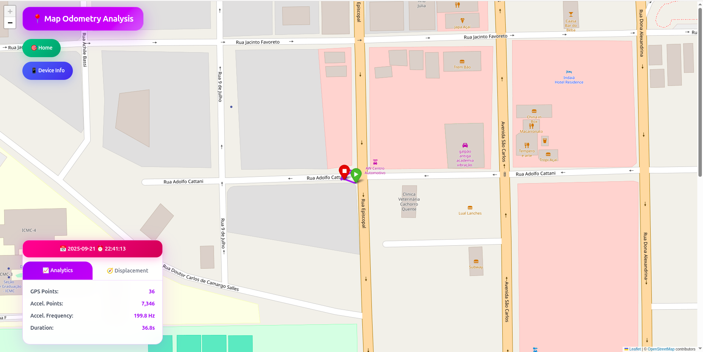
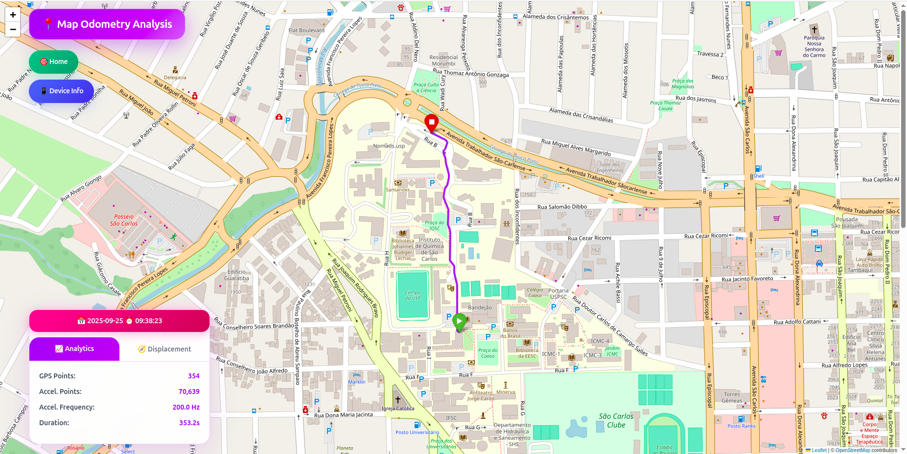
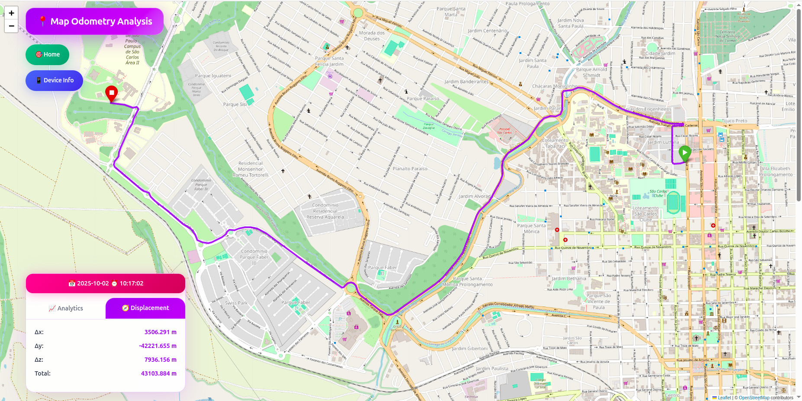
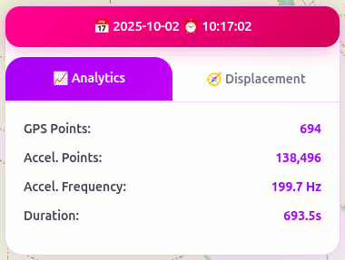
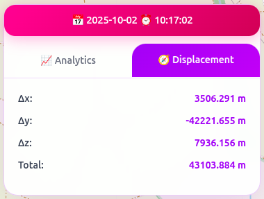

# 📍 Map Odometry Analysis Dashboard

This project is part of the discipline [SSC-715-2016 – Smart Sensors](http://wiki.icmc.usp.br/index.php/SSC-715-2016(fosorio)) at USP São Carlos.  
The goal is to provide an **interactive dashboard** for processing and visualizing sensor data collected with the [Phyphox](https://phyphox.org/) mobile application.

---

## 🔎 Introduction

The **purpose** of this tool is to process and display sensor data in an interactive **web-based dashboard**.  
Data is collected through the **Phyphox** application, which provides access to various smartphone sensors such as **GPS** and **linear acceleration**.  

- The collected **GPS data** is plotted on an interactive map using the [Folium library](https://python-visualization.github.io/folium/) in Python.  
- The map is exported as an HTML file (e.g., `index.html`), which can be opened in any browser.  
- Interactive panels on the page display **metadata about the device**, as well as sensor information.  

This project is licensed under the **MIT License**, in the same spirit as the [Phyphox application license](https://phyphox.org/) and the [Folium library license](https://github.com/python-visualization/folium/blob/main/LICENSE).  
You are free to **use, modify, and distribute** this tool under MIT terms.

---

## 🛰️ Data Collected

1. **GPS Data**  
   - Latitude and longitude points collected by the smartphone.  
   - Plotted on an interactive map with start and end markers.  
   - Outlier GPS points are filtered at the beginning of the trace to avoid divergence.

2. **Linear Acceleration Data**  
   - Captured from the smartphone’s linear acceleration sensor.  
   - Filtered using a **Savitzky–Golay filter** to reduce noise.  

   The filtering step is mathematically described as:  

   $$
   \hat{a}(t) = \text{SavGol}(a(t), w, d)
   $$  

   where:  
   - $a(t)$ = raw acceleration signal  
   - $w$ = window length  
   - $d$ = polynomial order  

   - After filtering, the acceleration is **numerically integrated twice**:  
     - **First integration:** acceleration → velocity  
     - **Second integration:** velocity → displacement  

   - This produces an estimate of **displacement vectors** in $x$, $y$, and $z$.

3. **Device and Experiment Metadata**  
   - Device model, brand, manufacturer, and Android version.  
   - Sensor specifications (range, resolution, power, etc.).  
   - Experiment timing information (start, end, and duration).

---

## 📊 Dashboard Overview

- **Interactive Map:**  
  Displays the GPS trajectory with smooth zooming and panning.  
  Initial and final positions are highlighted with markers.

- **Analytics Panel:**  
  Shows metrics such as number of GPS points, number of acceleration samples, and sampling frequency.

- **Displacement Panel:**  
  Displays the estimated displacement values for $x$, $y$, and $z$, as well as the total displacement magnitude.

- **Device Info Modal:**  
  Provides detailed information about the smartphone and sensors used during data collection.

---

## 📷 Example Figures

Below are example figures generated by the dashboard from different datasets:

 

<b>Figure 1:</b> Small GPS trajectory example.  

 

<b>Figure 2:</b> Medium-sized GPS trajectory example.  

 

<b>Figure 3:</b> Large GPS trajectory example.  

 

<b>Figure 4:</b> Example of the <b>analytics panel</b>, showing metrics such as GPS points, acceleration points, frequency, and duration.  

 

<b>Figure 5:</b> Example of the <b>displacement panel</b>, showing Δx, Δy, Δz, and total displacement.  

---

## ⚖️ License

This project is licensed under the **MIT License**.  
It incorporates data collected with the [Phyphox application](https://phyphox.org/) (freely available for educational and research use) and visualization through the [Folium library](https://python-visualization.github.io/folium/), also MIT licensed.

---

## 📌 Author

Lucas Sales Duarte  
NUSP: 11734490  
Discipline: <b>SSC-715-2016 – USP São Carlos</b>

